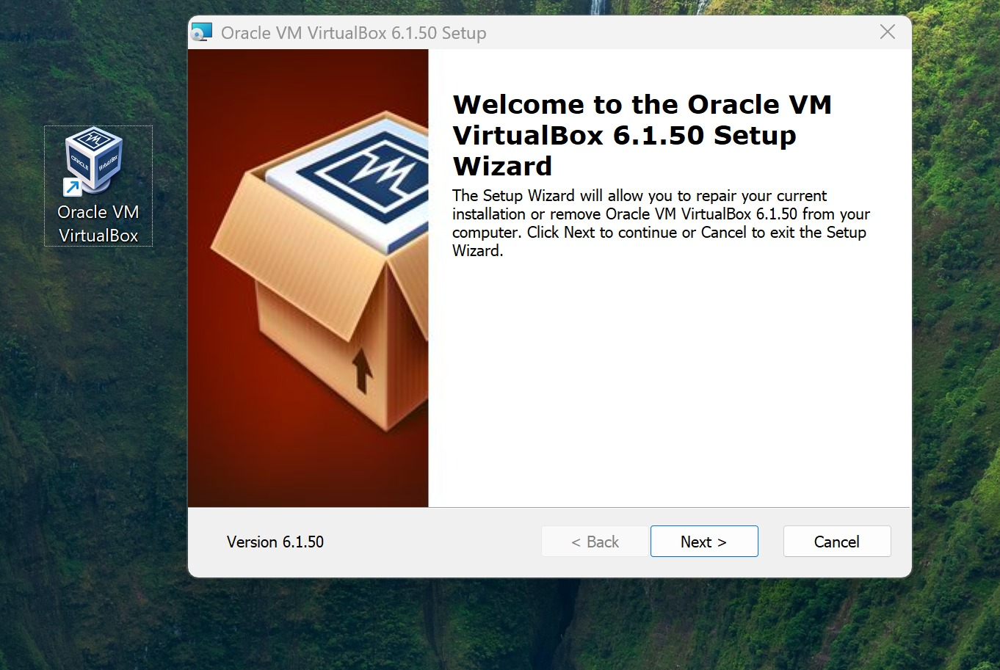
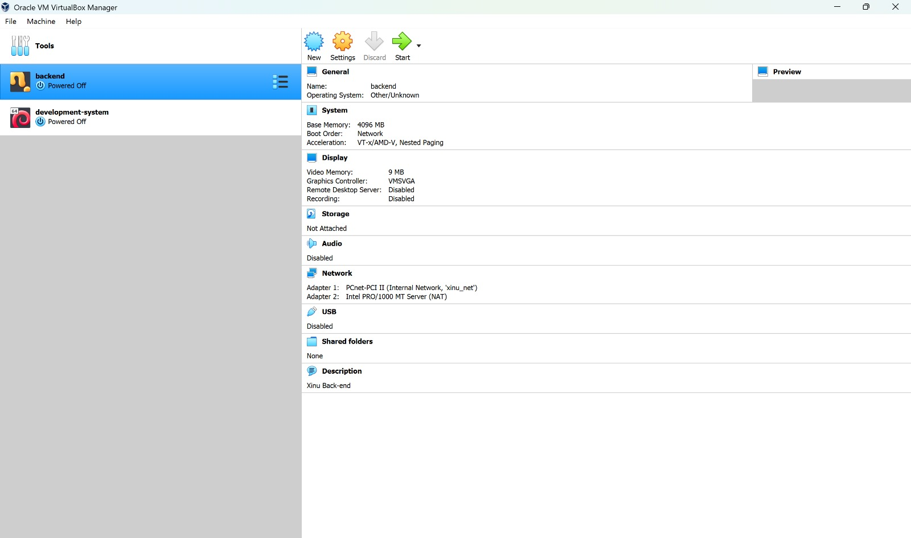

<h1 align="center">Laporan Praktikum Modul 01   Virtual Machine</h1> 
Yoga Eka Pratama – NIM 2311104023

Dasar Teori
Virtual Machine (VM) adalah teknologi yang memungkinkan sebuah komputer menjalankan sistem operasi lain secara virtual tanpa harus menginstalnya secara langsung pada perangkat keras utama. VM bekerja dengan bantuan hypervisor yang mengelola sumber daya seperti CPU, RAM, dan penyimpanan agar dapat digunakan oleh beberapa sistem operasi sekaligus.

Salah satu software virtualisasi yang populer adalah Oracle VM VirtualBox. VirtualBox memungkinkan pengguna untuk membuat, menjalankan, dan mengelola mesin virtual dengan mudah. Teknologi ini banyak digunakan untuk praktikum sistem operasi, simulasi jaringan, keamanan sistem, dan pengembangan perangkat lunak.

Guided
Pada praktikum ini dilakukan beberapa tahapan sebagai berikut:
Menginstal Oracle VM VirtualBox.
Membuka dan menjalankan VirtualBox Manager.
Membuat dan mengelola mesin virtual.
Mengatur konfigurasi sistem seperti memori, jaringan, dan storage.
Menjalankan mesin virtual yang telah dibuat.

Langkah-Langkah Praktikum
1. Instalasi VirtualBox
Jalankan file installer VirtualBox 6.1.50.
Akan muncul tampilan Setup Wizard.
Klik tombol Next untuk melanjutkan proses instalasi.
Ikuti langkah instalasi hingga selesai.
Klik Finish setelah proses instalasi berhasil.

📌 Tampilan proses instalasi:

2. Membuka VirtualBox Manager
Buka aplikasi Oracle VM VirtualBox.
Akan muncul tampilan VirtualBox Manager.
Pada panel kiri terlihat daftar mesin virtual yang tersedia.
Pada panel kanan terdapat detail konfigurasi mesin virtual seperti:
Base Memory
Boot Order
Display
Storage
Network
USB
Shared Folder
📌 Tampilan VirtualBox Manager:

Kesimpulan
Dari praktikum ini dapat disimpulkan bahwa Oracle VM VirtualBox memudahkan pengguna dalam membuat dan mengelola mesin virtual. Dengan teknologi virtualisasi, pengguna dapat menjalankan sistem operasi tambahan tanpa mengganggu sistem utama. VirtualBox sangat bermanfaat untuk pembelajaran sistem operasi, simulasi jaringan, serta pengembangan perangkat lunak.
