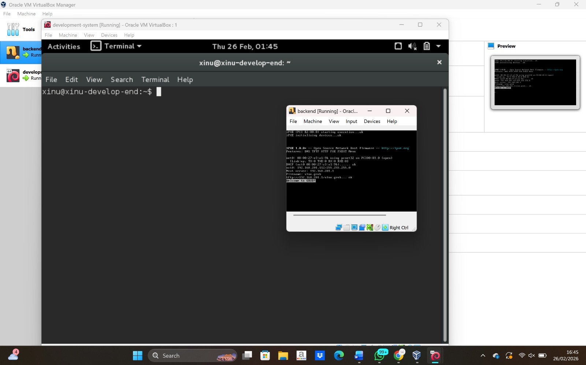
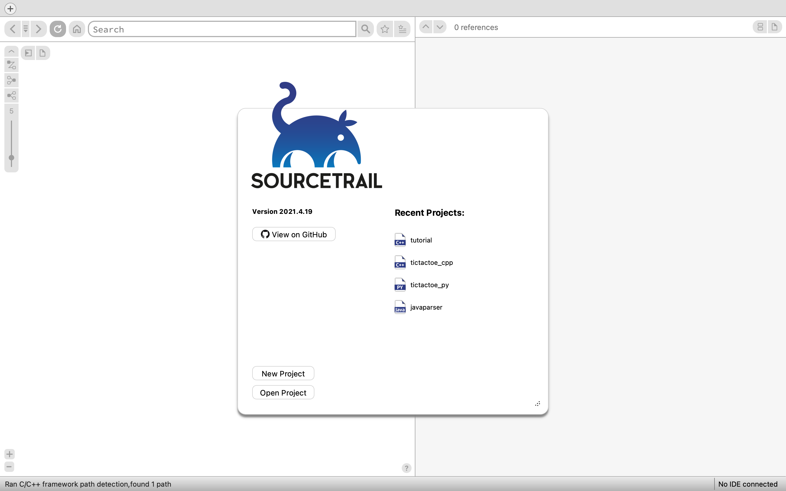

<h1 align="center">Laporan Praktikum Modul 02   Virtual Machine dan Version Control</h1> 
Yoga Eka Pratama – NIM 2311104023

Dasar Teori
Virtual Machine (VM) adalah teknologi virtualisasi yang memungkinkan satu perangkat keras menjalankan lebih dari satu sistem operasi secara bersamaan. VM bekerja dengan cara membuat lingkungan sistem operasi virtual yang terisolasi dari sistem utama. Salah satu software yang umum digunakan untuk membuat VM adalah VirtualBox. Dengan VM, pengguna dapat melakukan pengujian sistem, simulasi jaringan, dan pengembangan perangkat lunak tanpa memengaruhi sistem utama.

Guided
Pada praktikum ini dilakukan beberapa tahapan sebagai berikut:
Menjalankan sistem operasi Linux menggunakan Oracle VM VirtualBox.

Dokumentasi
1. Tampilan Virtual Box

2. Tampilan SourceTrail

Referensi
https://en.wikipedia.org/wiki/Virtual_machine
