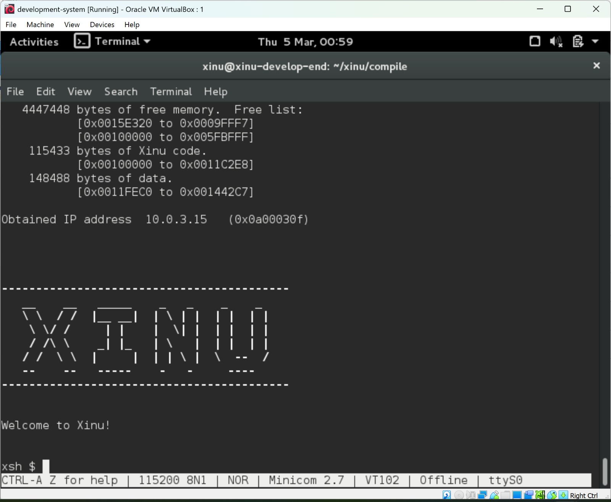

<h1 align="center">Laporan Praktikum Modul 03   Xinu Operating System</h1> 
Yoga Eka Pratama – NIM 2311104023

Dasar Teori
Xinu (Xinu Is Not Unix) adalah sistem operasi kecil yang digunakan untuk tujuan pembelajaran konsep dasar sistem operasi seperti manajemen proses, memori, dan jaringan. 

Xinu menyediakan shell yang memungkinkan pengguna menjalankan berbagai perintah untuk melihat informasi sistem, mengelola proses, dan melakukan konfigurasi jaringan. Melalui shell tersebut, pengguna dapat berinteraksi langsung dengan kernel untuk memahami bagaimana sistem operasi bekerja.

Guided

Pada praktikum ini dilakukan beberapa tahapan sebagai berikut:
Menjalankan sistem operasi Xinu OS pada Virtual Machine.
Mengakses Xinu Shell (xsh) melalui terminal menggunakan Minicom.
Menjalankan berbagai perintah yang tersedia pada Xinu untuk mengetahui fungsi serta informasi sistem.
Hasil dan Pembahasan

1.Menjalankan Perintah pada Shell Xinu
Beberapa perintah dasar pada Xinu beserta fungsinya:

help
Menampilkan seluruh daftar perintah yang tersedia pada shell Xinu.

ps
Menampilkan daftar proses yang sedang berjalan pada sistem beserta PID, prioritas, dan state proses.

kill
Digunakan untuk menghentikan suatu proses berdasarkan PID.

Jawaban Pertanyaan
1. Berapa jumlah perintah pada Xinu?
Terdapat sekitar 20 perintah yang tersedia pada shell Xinu (dapat dilihat menggunakan perintah help).

2. Sebutkan 2 perintah yang mempunyai fungsi yang sama!
help dan ?
Keduanya digunakan untuk menampilkan daftar perintah yang tersedia pada Xinu.

3. Berapa IP address Xinu?
IP address Xinu adalah 10.0.3.15.

4. Perintah apa yang digunakan untuk mengetahui IP address?
Perintah yang digunakan adalah ifconfig.

5. Berapa IP DNS server yang digunakan oleh Xinu?
IP DNS server yang digunakan adalah 10.0.3.3.

6. Terdapat berapa proses yang sedang berjalan pada Xinu?
Terdapat sekitar 5 proses yang berjalan pada sistem (dapat dilihat dengan perintah ps).

7. Proses apa yang mempunyai prioritas paling rendah?
Proses dengan prioritas paling rendah adalah null process.

8. Proses apa yang mempunyai ukuran paling besar?
Proses dengan ukuran paling besar adalah shell process.

9. Proses apa yang berada dalam state current?
Proses yang berada pada state current adalah shell.

10. Proses apa yang berada dalam state suspend?
Proses yang berada pada state suspend biasanya adalah main process.

11. Berapa PID (Process ID) dari Main process?
PID dari Main process adalah 1.

Dokumentasi
Tampilan Xinu OS

Referensi
https://en.wikipedia.org/wiki/Xinu