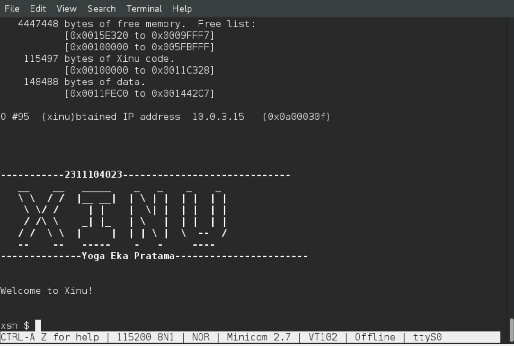

<h1 align="center">Laporan Praktikum Modul 04   Membaca Source Code Xinu</h1>

 Yoga Eka Pratama – NIM 2311104023 

Dasar Teori

Xinu (Xinu Is Not Unix) merupakan sistem operasi sederhana yang digunakan untuk mempelajari konsep dasar sistem operasi seperti manajemen proses, memori, dan interaksi kernel. Source code Xinu ditulis menggunakan bahasa C dan disusun secara modular, sehingga mudah dipahami oleh mahasiswa. Struktur programnya terdiri dari kernel, shell, serta file header (.h) yang berisi deklarasi fungsi dan struktur data penting, termasuk struktur proses yang digunakan dalam pengelolaan eksekusi program.

Pembahasan
Setelah melakukan proses kompilasi pada Xinu, dihasilkan sebuah file image bernama xinu.elf yang berada pada direktori xinu/compile/. File ini memiliki ukuran sekitar 100–200 KB tergantung pada konfigurasi dan perubahan yang dilakukan pada source code. File inilah yang kemudian dijalankan pada virtual machine untuk menjalankan sistem operasi Xinu.

Struktur data proses pada Xinu dapat ditemukan pada file include/process.h dengan nama struktur procent. Struktur ini menyimpan berbagai informasi penting terkait proses, seperti status proses, prioritas, pointer stack, ukuran stack, nama proses, hingga process ID.

Selain itu, terdapat juga informasi lain seperti parent process dan mekanisme komunikasi antar proses. Struktur ini berperan penting dalam pengelolaan multitasking pada sistem operasi Xinu.

Pada praktikum ini juga dilakukan modifikasi terhadap tampilan welcome banner Xinu. Perubahan dilakukan dengan mencari file yang berkaitan dengan tampilan shell, yaitu pada bagian xinu/include dan xinu/shell. Setelah menemukan bagian kode yang menampilkan banner, dilakukan perubahan dengan menambahkan nama dan NIM praktikan. Setelah itu, sistem dikompilasi ulang menggunakan perintah make clean dan make, kemudian dijalankan kembali menggunakan minicom. 

Hasilnya menunjukkan bahwa banner berhasil diubah sesuai dengan yang diinginkan tanpa mengganggu fungsi sistem.

Dokumentasi

Kesimpulan
Dari praktikum ini dapat disimpulkan bahwa source code Xinu memiliki struktur yang sederhana dan mudah dipahami untuk pembelajaran sistem operasi. Struktur data proses menjadi bagian penting dalam pengelolaan eksekusi program, dan modifikasi sederhana seperti perubahan banner dapat dilakukan dengan memahami alur program pada bagian shell. Proses kompilasi ulang diperlukan agar setiap perubahan dapat diterapkan pada sistem.

Referensi

https://en.wikipedia.org/wiki/Xinu
